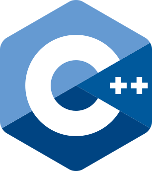
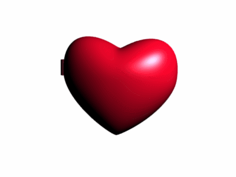

# Hello, I'm Oleksandr! 

Software engineering student interested in web development and creating engaging user experiences.

## 🧑‍💻 About Me

- 🌱 Currently exploring modern JavaScript frameworks and design systems
- 🔍 Interested in clean code architecture and responsive design principles
- 🌐 Working on building accessible and performant web applications

## 🛠️ Tech Stack

<table style="display: flex; align-items: flex-start; align: center">
  <tr>
    <td align="center" width="96">
      
       HTML5
    </td>
    <td align="center" width="96">
      
       CSS3
    </td>
    <td align="center" width="96">
      
       JavaScript
    </td>
    <td align="center" width="96">
      
       TypeScript
    </td>
    <td align="center" width="96">
      
       Python
    </td>
    <td align="center" width="96">
      
       C++
    </td>
  </tr>
  <tr>
    <td align="center" width="96">
      
       React.js
    </td>
    <td align="center" width="96">
      
       Tailwind
    </td>
    <td align="center" width="96">
      
       MongoDB
    </td>
    <td align="center" width="96">
      
       Git
    </td>
    <td align="center" width="96">
      
       VSCode
    </td>
    <td align="center" width="96">
      
       Figma
    </td>
  </tr>
</table>

<!-- ## 🚀 Current Projects

- **Personal Portfolio Website** - Showcasing my projects and skills using React and Tailwind CSS
- **Task Management Application** - Full-stack app with TypeScript, MongoDB, and Express
- **Open Source Contributions** - Contributing to community projects to improve collaboration skills -->

## 📊 GitHub Stats

  
  

## 📫 Connect With Me

  
  
  
  

  
❤️

  

    
    
<i>Good layout is the foundation of great design</i>

  

